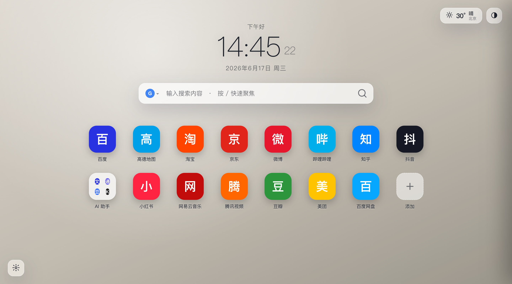
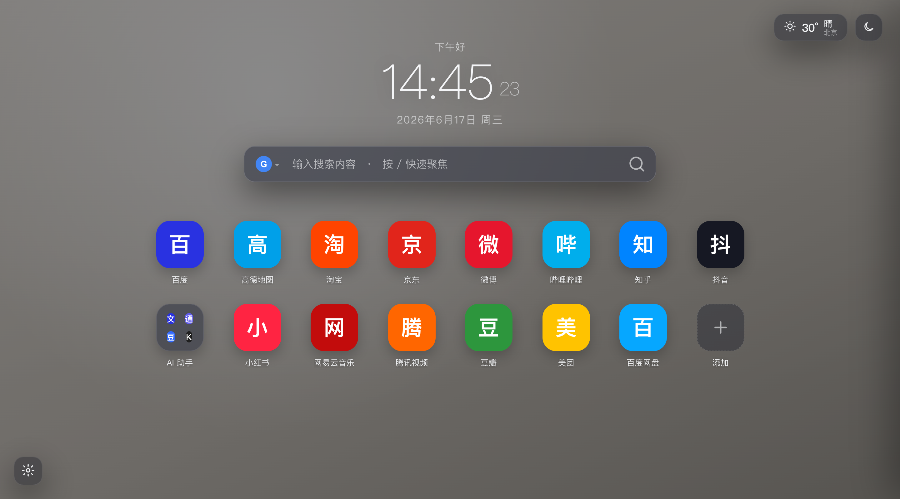
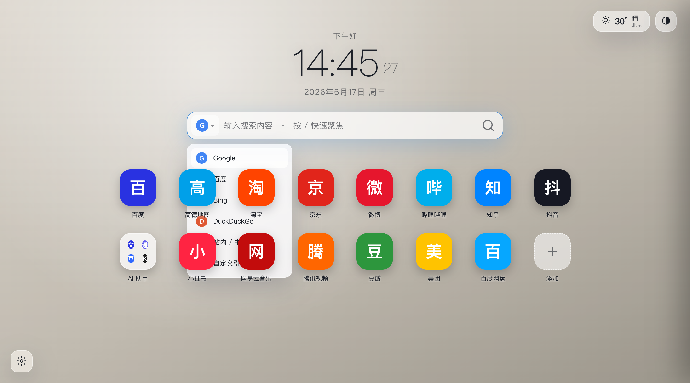
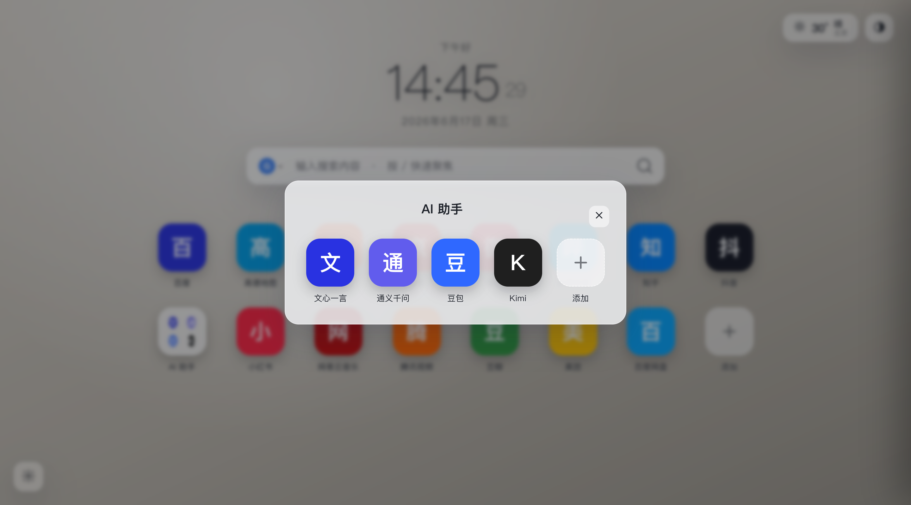
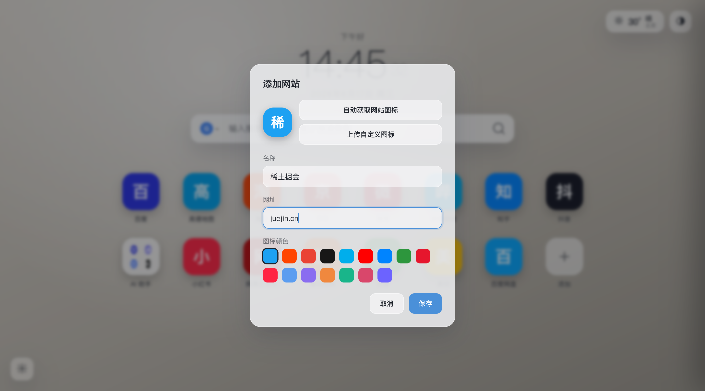
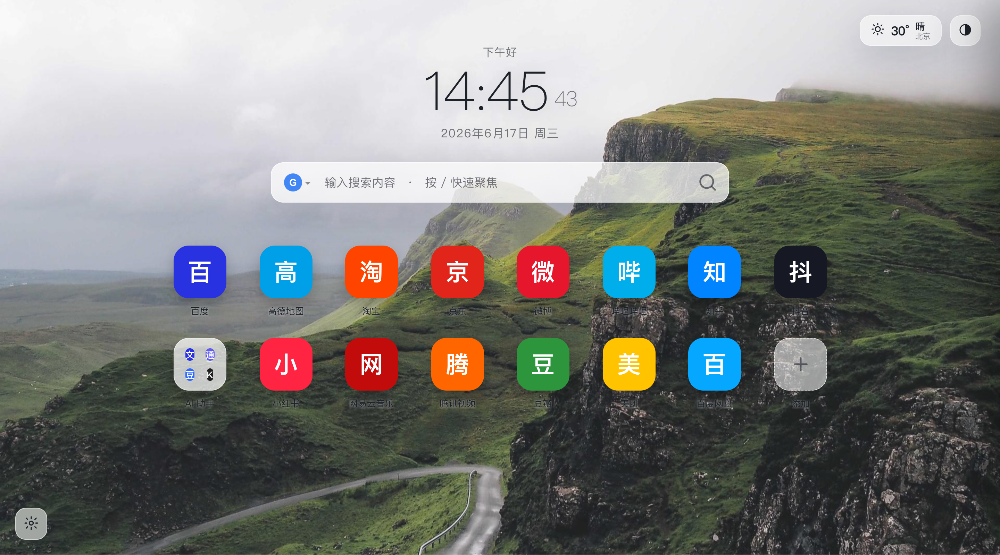
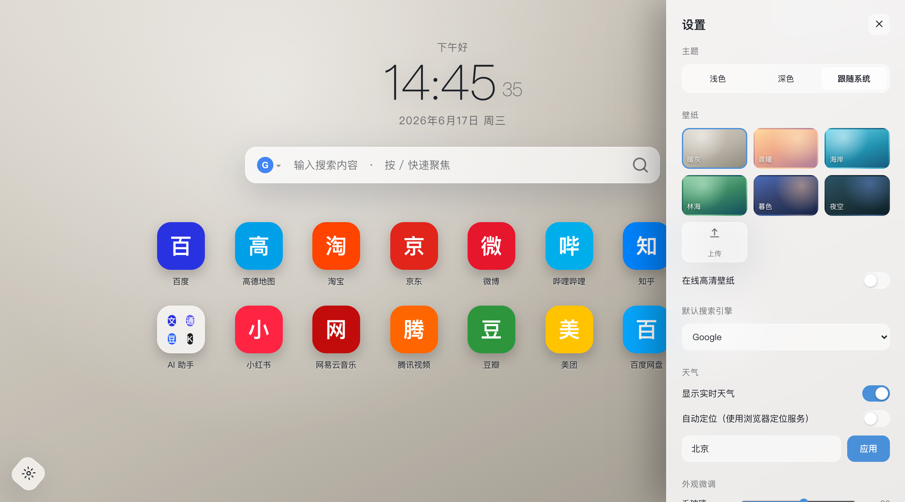
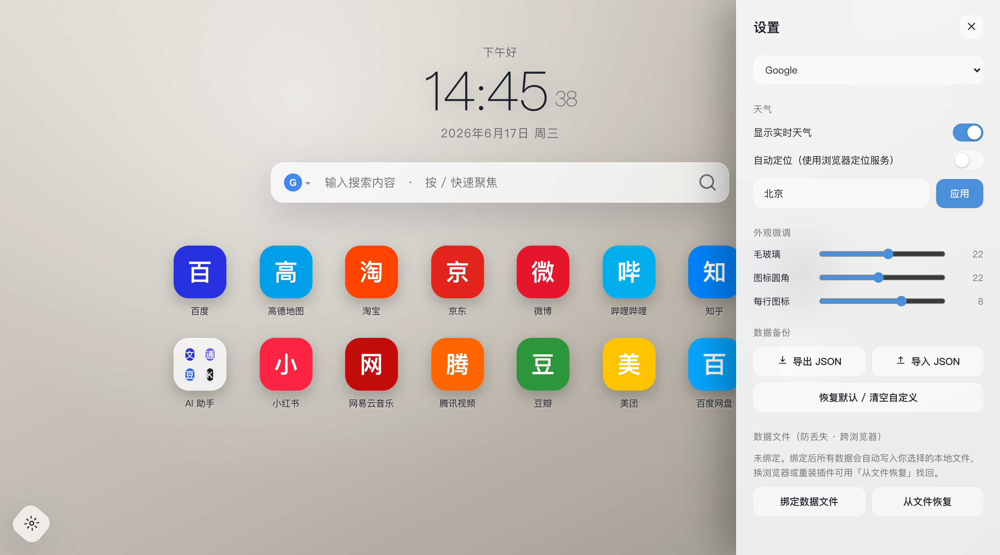
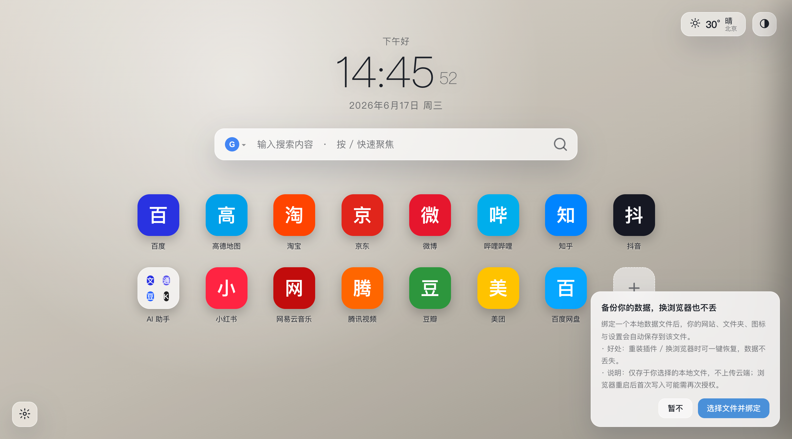

<div align="center">

# 新格 · 新标签页 · NovaTab

**一款玻璃质感、完全开源、本地优先的 Chrome 新标签页扩展**

实时天气 · 多引擎搜索 · 快捷方式与文件夹 · 在线高清壁纸 · 主题与个性化 · 本地数据文件

**🔓 完全开源（MIT） · 🧩 零依赖零构建 · 📴 本地优先可离线 · 🔒 无账号无追踪，数据不出本机**

[](LICENSE)




</div>

---

## ✨ 特性

- 🕒 **时钟 / 日期 / 问候语** —— 实时时钟、中文日期与星期、按时段问候。
- 🌤️ **实时天气** —— 由 [Open-Meteo](https://open-meteo.com)（免 API Key）提供；**自动定位**优先使用浏览器定位服务（精确，不用 IP，避免代理误判），未授权时弹通知询问；也可关闭自动定位手动指定城市。
- 🔍 **多引擎搜索** —— Google / 百度 / Bing / DuckDuckGo / 站内书签 / 自定义引擎，下拉切换，回车搜索，`/` 快捷聚焦，输入即联想本地快捷方式。
- 🧩 **快捷方式与文件夹** —— 拖拽排序、拖入文件夹、拖拽合并；空白处右键新建文件夹；添加站点时自动抓取网站图标并**内嵌缓存为本地图片**，之后不再重复联网请求。
- 🎨 **主题与壁纸** —— 浅色 / 深色 / 跟随系统；6 套内置渐变 + 自定义上传 + **在线高清壁纸**（[Wallhaven](https://wallhaven.cc)，可选风格、自动/手动更换、自定义频率）；壁纸图片**本地缓存**，未到更换时间直接复用、不重复下载。
- ⚙️ **个性化** —— 毛玻璃强度、图标圆角、每行图标数随手可调。
- 💾 **数据不丢失** —— 全部本地存储；可导出/导入 JSON，或**绑定本地数据文件**自动同步，换浏览器、重装插件一键找回。
- 🔒 **隐私优先** —— 无账号、无追踪、无云端；数据只存在你的浏览器与你选择的本地文件中。

## 📸 界面预览

| 主界面（国内常用站点） | 深色主题 |
| :---: | :---: |
|  |  |

| 多引擎搜索 | 文件夹 |
| :---: | :---: |
|  |  |

| 添加网站（自动获取图标） | 在线高清壁纸 |
| :---: | :---: |
|  |  |

| 设置 · 主题与壁纸 | 设置 · 天气与数据文件 |
| :---: | :---: |
|  |  |

<div align="center">

**首次安装 · 数据文件绑定引导**



</div>

## 🚀 安装（加载未打包扩展）

1. 下载或 `git clone` 本仓库。
2. 打开 Chrome，地址栏访问 `chrome://extensions`。
3. 打开右上角「开发者模式」。
4. 点击「加载已解压的扩展程序」，选择本仓库的 [`extension/`](extension/) 目录。
5. 新开一个标签页，即是新格 NovaTab。

> 首次使用天气时，浏览器会弹出原生定位授权提示，点「允许」即可获取当前位置的天气。

## 🧭 使用小贴士

- 按 `/` 快速聚焦搜索框；输入时会联想已添加的快捷方式，方向键选择、回车直达。
- 点击搜索框左侧图标可切换搜索引擎；点击右上角天气可手动刷新。
- 拖动图标可排序，拖到另一个图标中心可合并成文件夹，拖到文件夹上可放入。
- 在空白处右键可「新建文件夹 / 添加网站」。
- 左下角齿轮进入设置；点击设置面板以外区域可自动关闭。

## 🔐 隐私与离线

> **完全开源、本地优先、无数据泄露之忧。**

- **代码完全开源（MIT）**：没有任何混淆或闭源逻辑，所有行为都可在本仓库审计。
- **无账号、无追踪、无遥测、无云端**：不收集、不上传你的任何个人数据或浏览行为。
- **数据只存在本机**：全部偏好与快捷方式保存在浏览器本地（`localStorage`）及你**主动绑定**的本地文件中。
- **核心功能可完全离线**：时钟、搜索跳转、快捷方式与文件夹、主题、自定义壁纸、数据导入导出 —— 断网也能用。
- **联网功能均可选、可关闭**：仅「天气 / 经纬度反查 / 网站图标 / 在线壁纸」会按需调用下列**公开免 Key 接口**，且只传递功能所必需的信息（城市或经纬度、网站域名），不附带任何身份信息；网站图标与壁纸还会**本地缓存**，不重复请求。

| 可选联网功能 | 接口 | 传递的信息 |
| --- | --- | --- |
| 天气数据 | `api.open-meteo.com` / `geocoding-api.open-meteo.com` | 城市名或经纬度 |
| 经纬度反查城市名 | `api.bigdatacloud.net` | 经纬度 |
| 网站图标抓取（一次性，之后缓存） | `www.google.com/s2/favicons` | 网站域名 |
| 在线高清壁纸（缓存复用） | `wallhaven.cc` | 壁纸风格关键词 |

> 想完全断网使用？关闭「显示实时天气」、不启用「在线壁纸」、用「上传自定义图标」即可——扩展不会发出任何网络请求。

## 🛠️ 技术栈

- **零依赖、零构建**：纯原生 HTML + CSS + JavaScript。
- **Manifest V3**，通过 `chrome_url_overrides` 接管新标签页。
- 持久化：`localStorage` + 可选 [File System Access API](https://developer.mozilla.org/docs/Web/API/File_System_API) 本地文件同步。

## 📁 目录结构

```
novatab/
├── extension/              # 扩展本体（加载此目录）
│   ├── manifest.json       # MV3 配置
│   ├── newtab.html         # 页面结构
│   ├── styles.css          # 样式系统（玻璃质感 / 主题变量 / 动效）
│   ├── app.js              # 全部交互逻辑（零依赖）
│   ├── icons/              # 扩展图标 16/48/128
│   └── README.md           # 扩展说明
├── docs/
│   ├── images/             # 界面截图
│   └── 原型设计参考-离线版.html  # 原始玻璃拟态设计原型（单文件）
├── LICENSE                 # MIT
└── README.md
```

## 🤝 贡献

欢迎 Issue 与 PR。本项目无需安装依赖、无需构建：直接修改 `extension/` 下的源码，在 `chrome://extensions` 重新加载即可预览。提交前请确保：

- 改动聚焦、风格与现有代码一致；
- 在 Chrome 实测新标签页功能正常、控制台无报错。

## 🙏 致谢

天气数据来自 [Open-Meteo](https://open-meteo.com)，城市反查来自 [BigDataCloud](https://www.bigdatacloud.com)，在线壁纸来自 [Wallhaven](https://wallhaven.cc)。界面采用玻璃拟态（glassmorphism）风格设计。

## 📄 许可证

[MIT](LICENSE) © 2026 NovaTab Contributors
